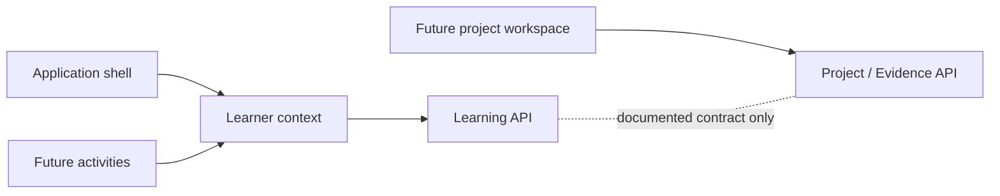

# Application architecture

## Scope

This repository currently contains Component 1: the reusable application shell for the T Level Digital Software Development Hub. It establishes the navigation, visual language, page structure and future integration boundaries. It deliberately does not contain curriculum content, learner forms, activities, assessment content, data storage or API calls.

The site is a collection of static HTML pages enhanced with shared CSS and JavaScript. It can be served directly by GitHub Pages without a build step.

## Structure

```text
/
├── index.html
├── course-guide/
├── foundations/
├── projects/
├── task-1/
├── task-2/
├── task-3/
├── assessment-practice/
├── resources/
├── help/
├── css/
│   ├── main.css
│   ├── components.css
│   └── utilities.css
├── js/
│   ├── config/app-config.js
│   └── core/
│       ├── navigation.js
│       └── utils.js
└── docs/
    ├── ARCHITECTURE.md
    └── DEVELOPMENT.md
```

Every route is represented by a directory containing an `index.html` file. This keeps URLs clean and ensures links work on GitHub Pages. Pages use relative paths so the site can be hosted under a project subdirectory rather than only at a domain root.

## Application shell

The shell has four layers:

1. Semantic HTML provides page-specific content, breadcrumbs, the main content landmark and the footer.
2. `main.css` provides design tokens, typography, document defaults and focus treatment.
3. `components.css` provides the header, course navigation, study cards and footer.
4. `app-config.js`, `utils.js` and `navigation.js` provide central navigation data and progressive interaction.

The course sidebar and mobile navigation are generated from one configuration source. Each page declares its route with `data-page` and its relative site root with `data-root`. `navigation.js` uses these values to create correct links, mark the current page with `aria-current="page"`, and manage the mobile menu.

## Learner identity boundary

Learner identity will be a shared application-level context. It must not be created, copied or owned by individual activities.

The canonical learner profile contains:

- Academic Year
- Programme
- Qualification
- Class Group
- Student ID
- First Name
- Surname

The field names are recorded in `app-config.js` as architecture metadata only. Component 1 does not collect, display, validate, persist or transmit these values.

The future dependency order is:

1. An activity reads the learner context.
2. The learner context supplies the agreed profile.
3. The Learning API receives the required data through a documented interface.

An activity may read the shared learner context through an agreed interface. It must not maintain a separate learner record or send learner identity directly to an unrelated backend. This keeps the learner profile consistent and allows its privacy, validation and lifecycle rules to be managed in one place.

## Backend boundaries

Backend services are future concerns and are not implemented in Component 1. Two cohesive domains are planned.

### Learning API

The Learning API will own:

- activities
- diagnostics
- submissions
- progress

### Project / Evidence API

The Project / Evidence API will own:

- requirements
- source logs
- AI logs
- evidence
- project records

Each domain should keep closely related behaviour and data together (high cohesion). Communication between domains should be through small, documented contracts, with neither domain depending on the internal data structures of the other (low coupling).



No API URL, spreadsheet identifier, key or credential belongs in client-side source code. Runtime integration design must be reviewed before either API is connected.

## Accessibility approach

The shell provides:

- `lang="en-GB"` and British English copy;
- semantic header, navigation, main, section, article, aside and footer landmarks;
- a skip link that targets the focusable main content area;
- visible keyboard focus with a high-contrast outline;
- an accessible mobile menu button using `aria-expanded` and `aria-controls`;
- Escape-key menu closing and focus return;
- `aria-current="page"` for the active global navigation item;
- responsive layouts that do not rely on pointer interaction;
- system fonts and no external asset dependency;
- reduced-motion handling.

Future components must retain these behaviours and test any new interactive control with a keyboard and assistive technology.

## Security and privacy

The repository must never contain API keys, credentials, private learner data, spreadsheet IDs or Apps Script URLs. Git history is not a safe place for secrets, even if a later commit removes them.

Because the application is currently static, it has no authentication or authorisation boundary. Future learner or evidence features must not rely on hidden HTML or client-side checks to protect data.

## Architectural influences

The shell adapts the reusable ideas requested from the OCR Unit 3 Cyber Security Hub: one shared learner identity, reusable navigation, generic future activity concepts, accessibility and static hosting compatibility. It does not copy implementation details or create a dependency between the two hubs.

## Component boundary

Component 1 ends at the stable application shell. The next component should introduce the first agreed content model and validate it in the Foundations route before expanding into activities or backend integration.
