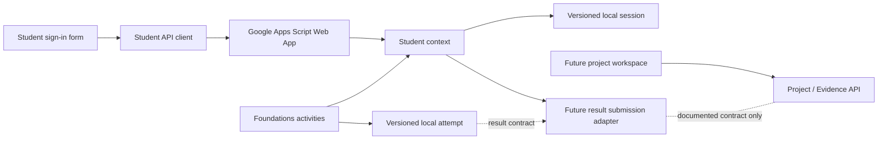

# Application architecture

## Scope

This repository contains the reusable application shell, the Priority 1 student identification foundation and the Software Development Foundations activity suite. It establishes the navigation, visual language, page structure, formative activity model and integration boundaries. It does not yet contain assessment systems, progress dashboards or result submission.

The site is a collection of static HTML pages enhanced with shared CSS and JavaScript. It can be served directly by GitHub Pages without a build step.

## Structure

```text
/
├── index.html
├── course-guide/
├── foundations/
│   ├── programming-diagnostic/
│   ├── requirements-classification/
│   ├── problem-decomposition/
│   ├── data-design/
│   └── testing-methods/
├── projects/
├── task-1/
├── task-2/
├── task-3/
├── assessment-practice/
├── resources/
├── help/
├── css/
│   ├── main.css
│   ├── components.css
│   ├── activities.css
│   └── utilities.css
├── js/
│   ├── config/
│   │   ├── app-config.js
│   │   └── student-api-config.js
│   ├── core/
│   │   ├── navigation.js
│   │   ├── student-api.js
│   │   ├── student-context.js
│   │   ├── student-session.js
│   │   ├── student-ui.js
│   │   └── utils.js
│   ├── activities/
│   │   ├── activity-engine.js
│   │   ├── activity-marking.js
│   │   ├── activity-state.js
│   │   └── foundations-landing.js
│   └── data/
│       └── foundations/
│           ├── catalog.js
│           ├── programming-diagnostic.js
│           ├── requirements-classification.js
│           ├── problem-decomposition.js
│           ├── data-design.js
│           └── testing-methods.js
├── test/
│   ├── site-integrity.test.js
│   ├── student-foundation.test.js
│   └── foundations-activities.test.js
└── docs/
    ├── ARCHITECTURE.md
    └── DEVELOPMENT.md
```

Every route is represented by a directory containing an `index.html` file. This keeps URLs clean and ensures links work on GitHub Pages. Pages use relative paths so the site can be hosted under a project subdirectory rather than only at a domain root.

## Application shell

The shell has five layers:

1. Semantic HTML provides page-specific content, breadcrumbs, the main content landmark and the footer.
2. `main.css` provides design tokens, typography, document defaults and focus treatment.
3. `components.css` provides the header, course navigation, study cards and footer.
4. `app-config.js`, `utils.js` and `navigation.js` provide central navigation data and progressive interaction.
5. The student API, session, context and UI modules provide one shared learner identity boundary.

The course sidebar and mobile navigation are generated from one configuration source. Each page declares its route with `data-page` and its relative site root with `data-root`. `navigation.js` uses these values to create correct links, mark the current page with `aria-current="page"`, and manage the mobile menu.

## Foundations activity architecture

The Foundations suite extends the shell through one reusable client-side pipeline:

```text
activity catalogue and question data
              ↓
generic activity renderer and deterministic marking
              ↓
learner interaction and explanatory feedback
              ↓
versioned local attempt and consistent result
              ↓
future Learning API adapter
```

Activity content is stored in `js/data/foundations/` and is kept separate from rendering and state behaviour. Every activity has a stable ID and semantic version. Every question has a stable ID such as `FOUND-PROG-VAR-001`. Supported data-driven interactions are single choice, multiple select, short text, matching and ordering. Ordering uses labelled position controls rather than mandatory drag-and-drop.

`activity-engine.js` renders section navigation, progress, questions, feedback and results. `activity-marking.js` contains unit-testable answer comparison, scoring, section indicators and result creation. `activity-state.js` owns lightweight activity progress. `foundations-landing.js` derives Start, Continue and Revisit states without inventing completion data.

The result model is ready for a future Learning API adapter and contains:

- `activityId`
- `activityVersion`
- `attemptId`
- `startedAt`
- `completedAt`
- `score`, `maxScore` and `percentage`
- section summaries
- question responses and awarded scores

No result is currently sent to a backend. Client-side answer keys are appropriate for these formative activities and are not presented as secure assessment material.

## Learner identity boundary

Learner identity is held in the application-level `StudentContext`. It must not be created, copied or owned by individual activities. The context exposes the current safe profile, sign-in status, `signIn()`, `signOut()` and `getStudentId()`.

The browser session contains only:

- Student ID
- First Name
- Display Name
- Class Group
- Sign-in timestamp

`StudentSession` is the only module that reads or writes the student identification session in local storage. It uses the versioned key `tlevel.softwareDevelopment.studentSession.v1`, validates restored data and discards malformed values. Restoration happens once as the scripts load and does not call the API again on every page view.

Foundations progress uses a separate versioned namespace, `tlevel.softwareDevelopment.foundations.v1`. `FoundationActivityState` scopes an attempt to the current student ID when available, or to a guest key when signed out. It stores only the current responses, submitted sections and most recent result. This browser-local data improves continuity but is not authoritative evidence or a security boundary.

Future activity and result submission code must retrieve the authoritative identifier with `StudentContext.getStudentId()`. It must submit `studentId`, not a display name, and the backend must continue to validate that ID. The browser session is a convenience and is not a security boundary.

## Backend boundaries

The first Learning API integration is implemented through the separate Google Apps Script Web App. Two cohesive domains remain the planned boundary.

### Learning API

The Learning API owns student identification and is the planned owner of:

- activities
- diagnostics
- submissions
- progress

### Project / Evidence API

The Project / Evidence API will own:

- requirements
- source logs
- AI logs
- evidence
- project records

Each domain should keep closely related behaviour and data together (high cohesion). Communication between domains should be through small, documented contracts, with neither domain depending on the internal data structures of the other (low coupling).



`student-api-config.js` is the only location for the public Apps Script `/exec` URL. Spreadsheet identifiers, private learner data, API keys and credentials do not belong in client-side source code.

## Accessibility approach

The shell provides:

- `lang="en-GB"` and British English copy;
- semantic header, navigation, main, section, article, aside and footer landmarks;
- a skip link that targets the focusable main content area;
- visible keyboard focus with a high-contrast outline;
- an accessible mobile menu button using `aria-expanded` and `aria-controls`;
- Escape-key menu closing and focus return;
- `aria-current="page"` for the active global navigation item;
- a semantic sign-in form with an explicit text-input label;
- an accessible modal heading, description, error region and loading announcement;
- focus placement for dialog opening, validation errors, sign-in and sign-out;
- touch-friendly account and form controls;
- responsive layouts that do not rely on pointer interaction;
- system fonts and no external asset dependency;
- reduced-motion handling.

The activity suite adds semantic fieldsets and legends, native radio buttons, checkboxes and selects, labelled short-answer fields, accessible progress values, text-based correctness indicators, live error and feedback regions, keyboard-operable section navigation, horizontally contained data tables and an HTML/CSS entity relationship representation.

Future components must retain these behaviours and test any new interactive control with a keyboard and assistive technology.

## Security and privacy

The repository must never contain API keys, credentials, private learner data or spreadsheet IDs. Git history is not a safe place for secrets, even if a later commit removes them. The deployed Apps Script Web App URL is public client configuration and is kept in one file.

Student ID lookup is identification, not password authentication or authorisation. Public learning content is not locked behind it. Future learner or evidence features must not rely on hidden HTML, local storage or client-side checks to protect data.

## Architectural influences

The shell adapts the reusable ideas requested from the OCR Unit 3 Cyber Security Hub: one shared learner identity, reusable navigation, generic future activity concepts, accessibility and static hosting compatibility. It does not copy implementation details or create a dependency between the two hubs.

## Current component boundary

Software Development Foundations ends with five complete formative activities, a reusable renderer, deterministic marking, browser-local continuity and a consistent result contract. It does not submit attempts, update Google Sheets, generate assessment evidence or provide a teacher dashboard. A future Learning API adapter can combine the result contract with `StudentContext.getStudentId()` without changing question content or the activity renderer.
