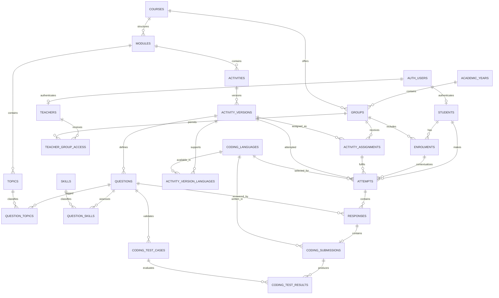

# Supabase/PostgreSQL architecture proposal (historical)

> This proposal predates the shared Core integration and backend-owned platform
> contracts. See [ARCHITECTURE.md](ARCHITECTURE.md) for the current repository
> boundary.

**Status:** Design proposal only

**Canonical repository:** `/Users/ricardorosa/Projects/tlevel-software-development-hub`

**Supabase project:** `RR NHC Hub` (`hubwpkrqndorznwzvaer`)

**Remote database changes made by this work:** None

This document records the current implementation and proposes a future Supabase/PostgreSQL architecture. It is not a migration, schema, policy, authentication, or deployment change. All SQL below is illustrative `SELECT` SQL only and has not been executed.

**Implementation follow-up:** The first local-only vertical slice is now represented by version-controlled migrations, synthetic fixtures and tests. See [Local Supabase vertical slice implementation](supabase-vertical-slice-implementation.md). Those assets have not been applied to the linked remote project; this proposal remains the target architecture beyond that deliberately narrow slice.

## 1. Executive summary

The Hub is a dependency-free static GitHub Pages application. It delivers five data-driven Foundations activities, identifies a learner through a student-ID lookup, stores detailed in-progress work and results in browser `localStorage`, and sends a narrow completed score to a standalone Google Apps Script Web App. Apps Script validates the student and activity against a private Google Sheet, appends an attempt, updates the latest result, and mirrors summary data into reporting tabs.

The current system is suitable for formative score collection, but it cannot provide the requested learning analytics. The browser creates rich per-question results, programming-language metadata, and raw coding responses, but `learning-api.js` deliberately transmits only the activity ID, activity version, attempt ID, score, maximum score, and source page. Consequently, Google Sheets has no production question-response data, topic or skill mapping, programming language, source code, or coding test outcomes.

The proposed target is a normalized PostgreSQL model with four clear areas:

1. identity and organisation: students, teachers, academic years, courses, groups, enrolments, and teacher access;
2. versioned curriculum metadata: modules, topics, skills, activities, immutable activity versions, questions, and mappings;
3. operational learning records: assignments, append-only attempts, per-question responses, code submissions, and test-case results;
4. derived analytics: ordinary SQL views and queries first, with materialized views introduced only if measured workload requires them.

Static teaching content, prompts, visible answer definitions, and formative marking rules should remain in Git. PostgreSQL should contain stable curriculum identifiers and taxonomy metadata needed to validate submissions and join learning records to versions, topics, and skills. Short code responses belong in PostgreSQL; large multi-file artefacts would belong in private Supabase Storage with database metadata, but no such artefact requirement exists today.

The recommended long-term identity model is Supabase Auth linked to application-owned `students` and `teachers` rows. The existing student-ID experience may remain while migration is under way, but an ID stored in `localStorage` is not authentication and must never be used to authorize direct Data API access. If suitable student Auth accounts cannot be provisioned, the safe fallback is to retain a trusted backend gateway and keep student tables unavailable to the browser.

The safest migration does not start with browser dual-write. Production Apps Script and Sheets should remain authoritative while the schema, Auth, RLS, and synthetic end-to-end path are proven. Historical summary data can then be imported and reconciled. A short controlled cutover is preferable to indefinite two-system writes; if a dual-write period becomes necessary, one trusted backend must coordinate idempotent writes and reconciliation.

## 2. Inspection scope and source of truth

The following implementation was inspected directly.

| Area | Files inspected | Finding |
|---|---|---|
| Application structure | `README.md`, `docs/ARCHITECTURE.md`, `docs/DEVELOPMENT.md`, all route HTML | Static HTML/CSS/JavaScript, directory-based GitHub Pages routes, no build step or package dependencies |
| Identity | `student-api.js`, `student-session.js`, `student-context.js`, `student-ui.js` | Student ID lookup followed by a safe profile stored in `localStorage`; no password or Supabase Auth |
| Submission | `learning-api.js`, `activity-engine.js` | Only a narrow client-calculated score summary reaches Apps Script |
| Activity state and marking | `activity-state.js`, `activity-marking.js`, `foundations-landing.js` | Detailed responses, section results, skill summaries, and latest result are retained locally per learner/activity/version |
| Programming Diagnostic | `programming-language.js`, `programming-editor.js`, `programming-checker.js`, `programming-feedback.js`, `programming-diagnostic.js` | Python, JavaScript, and C# variants; deterministic browser checks; no code execution or test cases |
| Other activity definitions | `requirements-classification.js`, `problem-decomposition.js`, `data-design.js`, `testing-methods.js` | Stable activity and question IDs with deterministic answer definitions in Git |
| Frontend tests | `test/student-foundation.test.js`, `test/foundations-activities.test.js`, `test/site-integrity.test.js` | Contract, local-state, marking, route, and accessibility checks; no RLS or server item-analytics tests |
| Apps Script backend | `/Users/ricardorosa/Projects/tlevel-software-development-api/*.gs`, its docs and tests | API 1.2, private Sheet access, student validation, score submission, attempts, latest results, progress, reporting mirrors, and audit logging |
| Supabase local state | `supabase/config.toml`, `supabase/.gitignore`, ignored `supabase/.temp/*`, local slice migrations/seed/tests | Initialized and linked locally; the repository now contains one un-applied development-only vertical slice, while the linked remote project remains unchanged |

Where earlier project descriptions differ from the repository, the repository is authoritative. Notable corrections are recorded in section 5.

## 3. Current architecture

### 3.1 Runtime, tooling, and routing

- Hosting: GitHub Pages under a project subdirectory.
- Framework: none.
- Build tooling: none.
- Package manager and application dependencies: none.
- Runtime: semantic HTML, shared CSS, and browser JavaScript loaded by script tags.
- Routing: 15 directory-backed routes, including five activity routes under `foundations/`.
- API: one public Google Apps Script `/exec` URL in `js/config/student-api-config.js`.
- Tests: dependency-free Node test runner plus prior browser checks.

### 3.2 Student identification and session

The learner enters a text student ID. `StudentApi.getStudent()` sends `getStudent` to Apps Script. Apps Script requires an exact active record in the `Students` sheet and returns only:

- `studentId`
- `firstName`
- `displayName`
- `group`

`StudentSession` stores those four fields plus `signedInAt` under:

```text
tlevel.softwareDevelopment.studentSession.v1
```

`StudentContext` restores the value, exposes it globally, and notifies subscribers. The value is a UI/session convenience. It is not cryptographic proof of identity, and anyone who knows another valid ID could claim it.

### 3.3 Activity delivery and local state

Activity definitions live in `js/data/foundations/`. Each activity has a stable ID, semantic version, sections, stable question IDs, answer definitions, feedback, and points. The catalogue currently contains:

| Activity | Version | Sections | Questions | Server maximum |
|---|---:|---:|---:|---:|
| Programming Diagnostic | `2.0.0` | 7 | 35 | 35 |
| Requirements Classification | `1.0.0` | 2 | 20 | 20 |
| Problem Decomposition | `1.0.0` | 4 | 17 | 17 |
| Data Design Knowledge Check | `1.0.0` | 4 | 18 | 18 |
| Testing Methods Classification | `1.0.0` | 4 | 22 | 22 |

Supported general question types are `single`, `multiple`, `text`, `matching`, and `order`. Programming-specific types are `predict-output`, `code-gap`, `line-select`, `code-order`, and `code-editor`.

Local activity records use keys shaped as:

```text
tlevel.softwareDevelopment.foundations.v1:<student-id-or-guest>:<activity-id>
```

A local attempt contains:

```text
activityId
activityVersion
attemptId
startedAt
currentSectionId
responses { questionId -> heterogeneous response }
submittedSections []
programmingLanguage (Programming Diagnostic only)
result
submission status
learnerKey
```

If a guest signs in while an activity is open, the guest attempt is copied to the learner-scoped key only when no learner attempt already exists. The original guest record remains.

### 3.4 Scoring and programming exercises

All current marking occurs in the public browser. General responses are compared deterministically against answer values. Programming responses are normalized and checked using accepted strings, ordering, selected line numbers, or small required/prohibited regular-expression rules.

The current Programming Diagnostic supports exactly:

- Python
- JavaScript
- C# (`csharp` internally)
- shared Basic SQL questions

The seven programming sections are Variables, Selection, Iteration, Functions, Arrays/Lists, Debugging, and Basic SQL. Questions are tagged only with the broad skills `knowledge`, `code-reading`, or `coding-debugging`. Non-programming activities have no implemented skill tags or difficulty values.

Learner code is never executed. There is no compiler, sandbox, code runner, test-case definition, or pass/fail test result. Source entered in a code editor is retained in the browser response object but is not sent to the backend.

### 3.5 Apps Script and Google Sheets

The standalone Apps Script project exposes:

- `health`
- `getStudent`
- `getStudentProgress`
- `submitResult`

The spreadsheet ID is held in the private `SPREADSHEET_ID` Script Property. The Web App executes as its deploying user; students do not receive Sheet access.

The authoritative operational sheets are:

- `Students`
- `Results`
- `Attempts`
- `Classes`
- `ActivityConfig`
- `AuditLog`

Accepted submissions are also mirrored into `Submissions v3`, `Learner Results`, and `API Attempt Index`. `Question Responses v1` exists structurally, but the public submission payload does not include `questionResponses`, so normal frontend submissions do not populate it.

`Attempts` is append-only for new attempt IDs. `Results` is updated in place per student/activity and therefore represents the latest received summary, not a first or best result. An identical retry of the same attempt ID is idempotent. Reusing the same ID with different student, activity, version, score, or maximum is rejected.

## 4. Current data flow and data collection

### 4.1 Identification flow

```text
Student enters allocated ID
  -> GitHub Pages sign-in dialog
  -> StudentApi POST { action: getStudent, studentId }
  -> Google Apps Script Web App
  -> Students sheet exact active-ID lookup
  -> safe profile { studentId, firstName, displayName, group }
  -> StudentContext
  -> localStorage student session
```

### 4.2 Activity and submission flow

```text
Versioned activity/question JavaScript in Git
  -> browser activity renderer
  -> learner responses and code snippets
  -> client-side deterministic marking
  -> full local result with sections, responses, skills and language
  -> learner-scoped localStorage
  -> LearningApi strips result to narrow score summary
  -> Apps Script validates active student + active ActivityConfig row
  -> Attempts append + Results latest upsert
  -> operational reporting mirrors
  -> submission status saved back into localStorage
```

### 4.3 Exact retention boundary

| Data | Browser | Request to Apps Script | Google Sheets |
|---|---|---|---|
| Student ID | Session and learner-scoped key | Yes | Yes |
| First/display name and group | Session | No on submission | Students; names/group duplicated in reporting mirrors |
| Surname and email | No | No | Students only; surname copied into some reporting mirrors |
| Activity ID and version | Local attempt/result | Yes | Attempts, Results, reporting mirrors |
| Client attempt ID | Local attempt/result | Yes | Attempts and reporting mirrors |
| Start/completion timestamps | Local result | No | No; backend records server submission time only |
| Score and maximum | Local result | Yes | Yes; percentage derived server-side |
| Section scores | Local result | No | No |
| Question responses | Local result | No | No for public submissions |
| Correctness/marks per question | Local result | No | No for public submissions |
| Broad programming skill summaries | Local result | No | No |
| Selected programming language | Local attempt/result | No | No |
| Code editor source | Local response | No | No |
| Coding tests passed/failed | Not produced | No | No |
| Source page | Available in browser | Yes | Reporting mirrors |
| Attempt number | No until response | Assigned by server | Yes |
| Submission retry state/error code | Local attempt | No persistent error detail | Audit contains action/status/message; public failures are not written to the optional error ledger by the current route |

### 4.4 Existing analytics and administration

Current analytics are limited to:

- per-student attempted/completed activity counts;
- per-student average of latest result summaries;
- last activity time;
- per-week attempted/completed counts and latest-result average;
- a Sheet dashboard with whole-workbook counts, mean latest-result percentage, and last attempt time.

The frontend does not call `getStudentProgress` and has no teacher/admin route. Staff administration is manual in Google Sheets. There is no topic, question, skill, language, coding exercise, test-case, cohort-trend, or intervention analysis.

## 5. Existing constraints and disproved assumptions

1. The system is not score-only inside the browser. It already creates detailed question-level result objects, but those details stop at `localStorage`.
2. The Google workbook has a `Question Responses v1` tab, but the public API does not populate it.
3. Repeated attempts are retained in `Attempts`; only the `Results` and `Learner Results` summaries are overwritten with the latest result.
4. Coding source is retained locally, not centrally. Coding test cases and test outcomes do not exist.
5. The only implemented skill taxonomy is three broad Programming Diagnostic labels. Other activities have no skill or difficulty metadata.
6. The backend has `getStudentProgress`, but there is no frontend progress dashboard or teacher dashboard.
7. The ID-only session is identification, not authentication. It cannot safely support direct RLS authorization.
8. The repository contains 15 routes and five complete activities, not merely the original ten-route shell.
9. A test named “no legacy activity submission” checks that there is no static HTML legacy form; it must not be interpreted as evidence that submission is absent. Dynamic submission is implemented.
10. `supabase init` and `supabase link` are complete locally. The first development-only schema and migration set was added after this proposal; it remains intentionally un-applied to the linked remote project.

## 6. Proposed target architecture

### 6.1 Design principles

- Keep curriculum content reviewable and versioned in Git.
- Make activity versions immutable after publication.
- Use stable activity/question keys from Git as business identifiers, with UUID database keys for relationships.
- Append attempts; never overwrite history.
- Store responses at question granularity so topic and skill analytics are derivable.
- Store the enrolment/assignment context used at submission time so later group changes do not rewrite history.
- Derive first/latest/best, improvement, and aggregate analytics through SQL.
- Avoid browser-supplied student IDs as authorization input; derive identity from an authenticated token.
- Do not trust browser-supplied scores for anything described as secure assessment.
- Keep PII and source code private, minimize retention, and record privileged access.
- Expose a narrow `api` schema of RLS-aware views and RPCs; keep core tables in an unexposed `learning` schema.

### 6.2 Target flow

```text
GitHub Pages static content + versioned question definitions
  -> Supabase Auth sign-in
  -> authenticated JWT
  -> exposed api schema (views and submit RPC only)
  -> server derives student from auth.uid()
  -> transaction validates immutable activity/question version
  -> learning.attempts + learning.responses
  -> optional coding submission / isolated runner outcomes
  -> RLS-scoped student views or teacher group analytics
```

For the migration period:

```text
Production students
  -> existing GitHub Pages + Apps Script + Sheets (authoritative)

Synthetic pilot users
  -> Supabase Auth + proposed API/RLS path

Validated reconciliation
  -> controlled cutover
```

### 6.3 Schema boundaries

- `learning`: base tables, not exposed through the Data API; RLS still enabled as defense in depth.
- `api`: explicitly exposed read views and submission/analytics functions only. Views must use `security_invoker = true` where they depend on underlying RLS.
- `auth`: Supabase-managed users; application code references only stable primary keys.
- `storage`: private buckets only for future large artefacts, not current short code snippets.

Supabase documents that custom schemas can be selectively exposed, RLS is required on exposed data, RLS-aware views should use `security_invoker`, publishable keys are safe only with correct RLS and grants, and secret/service-role keys must never be placed in a browser. See the official guidance on [custom schemas](https://supabase.com/docs/guides/api/using-custom-schemas), [RLS](https://supabase.com/docs/guides/database/postgres/row-level-security), [securing data](https://supabase.com/docs/guides/database/secure-data), and [API keys](https://supabase.com/docs/guides/getting-started/api-keys).

## 7. Git, PostgreSQL, Storage, and external responsibility split

| Category | Recommended home | Reason |
|---|---|---|
| Teaching explanations, prompts, scenarios, visible options | Git | Reviewed with code, deployed atomically with the activity, no database round trip |
| Visible formative answer definitions and deterministic browser marking rules | Git | Matches the current formative model; already inspectable in a public repository |
| Activity manifest/version/content hash | Git as source; PostgreSQL mirror | Git proves content history; database mirror validates submissions and anchors analytics |
| Stable question IDs and section IDs | Git as source; PostgreSQL mirror | Required to join responses to immutable activity versions |
| Topic, skill, difficulty, and question-type tags | Git manifest plus PostgreSQL relational rows | Tags should be reviewed with content but queried relationally |
| Student and teacher identities | Supabase Auth plus PostgreSQL profile rows | Private operational data with authenticated ownership |
| Academic years, courses, groups, enrolments, teacher scopes | PostgreSQL | Relational, mutable, private, and required for authorization/history |
| Attempts and completion state | PostgreSQL | Append-only operational records and analytics facts |
| Per-question responses and awarded marks | PostgreSQL | Required for question/topic/skill analytics |
| Short single-file source-code responses | PostgreSQL `text` | Current snippets are small and belong transactionally to a response |
| Large multi-file projects, uploaded evidence, binaries | Private Supabase Storage plus database metadata | Object storage is better for large artefacts; not needed for current Foundations work |
| Visible/sample coding tests | Git | Part of teaching content |
| Hidden executable tests and expected results | Private PostgreSQL/runner configuration, not exposed | Public Git would reveal them; execution needs a trusted isolated service |
| Coding test outcomes | PostgreSQL | Structured analytics by exercise/test/language |
| Audit events | PostgreSQL private schema and platform logs | Queryable application audit without exposing secrets or payloads |
| Secret/legacy service credentials | Trusted server secret store only | Never Git, browser code, database rows exposed by Data API, or public logs |
| Full database backups and disaster recovery | Supabase managed backups plus approved export process | Operational resilience rather than application content |

## 8. Analytics taxonomy

The current IDs form a good starting point but are not a complete analytics taxonomy.

### 8.1 Required hierarchy

```text
Course
  -> Module/curriculum area
  -> Topic
  -> Activity
  -> Immutable activity version
  -> Question/exercise
  -> Response

Question/exercise
  <-> Skill (many-to-many)
  <-> Topic (many-to-many where necessary)
```

### 8.2 Stable keys

- Preserve current activity keys such as `foundations-programming-diagnostic`.
- Preserve current question keys such as `FOUND-PROG-VAR-001` within each activity version.
- Add stable topic keys such as `variables`, `iteration`, and `basic-sql`.
- Expand skill keys beyond the current `knowledge`, `code-reading`, and `coding-debugging` only after curriculum review.
- Treat activity version plus content hash as immutable. A question changed in a way that can alter meaning or marking requires a new activity version.

### 8.3 Difficulty

No difficulty metadata exists today. Use a nullable reviewed scale, suggested `1` to `5`, rather than inferring difficulty from success rate. Observed difficulty is an analytic result; authored difficulty is curriculum metadata. They must remain separate.

### 8.4 Weighted mappings

A question may cover multiple topics or skills. Join tables should allow a positive weight, normally totalling `1.0` per dimension for a question. Initial data may use one topic and one skill with weight `1.0`. Validation tests, not ad hoc application code, should check totals.

## 9. Proposed ERD



`AUDIT_EVENTS` is intentionally not joined to every entity by a hard foreign key. It stores a typed entity reference so deletion or pseudonymisation does not erase the audit trail.

## 10. Detailed table definitions

### 10.1 Conventions

- Use `uuid` primary keys with server-generated values unless a small reference table explicitly uses `smallint`.
- Use `timestamptz` for events and `date` for academic calendar boundaries.
- Use `numeric(8,2)` for marks so future partial credit is possible. Do not use floating point for assessed values.
- Use constrained `text` values for statuses at first; change to lookup tables only when users need to manage those values.
- Use `created_at timestamptz NOT NULL DEFAULT now()` and `updated_at timestamptz NOT NULL DEFAULT now()` on mutable reference/profile tables.
- Keep stable human-readable keys separate from UUID primary keys.
- Do not hard-delete published curriculum, students with learning records, or historical organisation rows. Retire/deactivate them.
- Enable RLS on every table even when the containing schema is not exposed.
- Percentage is normally derived as `100 * score / max_score`; it is not a required stored column.

There is deliberately no standalone `scores` table. Attempt totals belong on `attempts`, and question-level awarded/max marks belong on `responses`. A separate score table would duplicate facts without adding a requirement.

### 10.2 Identity and organisation

#### `academic_years`

- **Purpose:** Named time boundary for groups and cohort reporting.
- **Primary key:** `id uuid`.
- **Important columns:** `code text NOT NULL`, `starts_on date NOT NULL`, `ends_on date NOT NULL`, `active boolean NOT NULL DEFAULT true`.
- **Constraints:** `UNIQUE (code)`; `ends_on >= starts_on`.
- **Indexes:** The unique code index is sufficient initially; optionally index active years by dates.
- **Delete behaviour:** `RESTRICT` when referenced by groups; deactivate instead.

#### `courses`

- **Purpose:** Course/programme definition, initially the T Level Software Development course.
- **Primary key:** `id uuid`.
- **Important columns:** `stable_key text NOT NULL`, `code text NULL`, `title text NOT NULL`, `qualification_level text NULL`, `active boolean NOT NULL DEFAULT true`.
- **Constraints:** `UNIQUE (stable_key)`; optional unique non-null course code.
- **Indexes:** `stable_key`; `active` only if the catalogue grows materially.
- **Delete behaviour:** `RESTRICT` when referenced; retire instead.

#### `groups`

- **Purpose:** A teachable cohort in one academic year and course.
- **Primary key:** `id uuid`.
- **Important columns:** `academic_year_id uuid NOT NULL`, `course_id uuid NOT NULL`, `code text NOT NULL`, `name text NOT NULL`, `active boolean NOT NULL DEFAULT true`.
- **Foreign keys:** Academic year and course with `ON DELETE RESTRICT`.
- **Constraints:** `UNIQUE (academic_year_id, course_id, code)`.
- **Indexes:** `(course_id, academic_year_id)`, and `(active, academic_year_id)` if active-group filtering becomes common.
- **Delete behaviour:** `RESTRICT`; preserve historical membership.

#### `students`

- **Purpose:** Application-owned learner profile and link to a verified Auth identity.
- **Primary key:** `id uuid`.
- **Important columns:** `auth_user_id uuid NULL`, `student_number text NOT NULL`, `first_name text NOT NULL`, `surname text NULL`, `display_name text NOT NULL`, `contact_email text NULL`, `active boolean NOT NULL DEFAULT true`, timestamps.
- **Foreign keys:** `auth_user_id` references the primary key of `auth.users`, `ON DELETE SET NULL`, so deleting an Auth identity does not erase educational records.
- **Constraints:** `UNIQUE (student_number)` and `UNIQUE (auth_user_id)` when non-null. Student numbers remain text and preserve leading zeroes.
- **Indexes:** `student_number`, `auth_user_id`, and partial/compound index for active-student administration if measured.
- **Nullability:** `auth_user_id` is nullable during migration and deprovisioning; every active learner using the Supabase path must have a linked Auth identity. `contact_email` should remain null unless there is an approved operational need to duplicate it outside Auth.
- **Delete behaviour:** Referenced students are deactivated or pseudonymised under an approved retention process, not casually deleted.

#### `teachers`

- **Purpose:** Application-owned staff profile linked to Supabase Auth.
- **Primary key:** `id uuid`.
- **Important columns:** `auth_user_id uuid NULL`, `staff_reference text NULL`, `display_name text NOT NULL`, `active boolean NOT NULL DEFAULT true`, timestamps.
- **Foreign keys:** `auth_user_id` references `auth.users(id)`, `ON DELETE SET NULL`, so Auth deprovisioning can revoke access without removing required staff attribution.
- **Constraints:** `UNIQUE (auth_user_id)`; optional unique non-null staff reference.
- **Nullability:** Every active teacher must have a linked Auth identity; null is reserved for deprovisioned historical profiles.
- **Indexes:** `auth_user_id`; active status only if needed.
- **Delete behaviour:** Revoke access and retain attribution required by audit/retention rules.

#### `enrolments`

- **Purpose:** Historical student membership of groups; provides the group context used by an attempt.
- **Primary key:** `id uuid`.
- **Important columns:** `student_id uuid NOT NULL`, `group_id uuid NOT NULL`, `joined_on date NOT NULL`, `left_on date NULL`, `status text NOT NULL` (`active`, `completed`, `withdrawn`), timestamps.
- **Foreign keys:** Student and group with `ON DELETE RESTRICT`.
- **Constraints:** `left_on IS NULL OR left_on >= joined_on`; `UNIQUE (student_id, group_id, joined_on)`.
- **Indexes:** `(student_id, status)`, `(group_id, status)`, `(group_id, joined_on, left_on)`.
- **Delete behaviour:** Preserve; close an enrolment with status/date.

#### `teacher_group_access`

- **Purpose:** Explicit authorization scope for teacher access to learners and analytics.
- **Primary key:** Composite `(teacher_id, group_id)` or a UUID plus that unique constraint. The composite key is sufficient.
- **Important columns:** `teacher_id uuid NOT NULL`, `group_id uuid NOT NULL`, `role text NOT NULL` (`teacher`, `lead`, `viewer`), `granted_at timestamptz NOT NULL`, `revoked_at timestamptz NULL`.
- **Foreign keys:** Teacher and group with `ON DELETE RESTRICT`.
- **Constraints:** At most one current access row per teacher/group, or preserve grants as history with a partial unique index where `revoked_at IS NULL`.
- **Indexes:** `(group_id, revoked_at)`, `(teacher_id, revoked_at)`; both help RLS checks.
- **Delete behaviour:** Revoke rather than delete when an audit trail is required.

### 10.3 Curriculum and taxonomy

#### `modules`

- **Purpose:** Course curriculum areas such as Foundations.
- **Primary key:** `id uuid`.
- **Important columns:** `course_id uuid NOT NULL`, `stable_key text NOT NULL`, `title text NOT NULL`, `sort_order integer NOT NULL DEFAULT 0`, `active boolean NOT NULL DEFAULT true`.
- **Foreign keys:** Course with `ON DELETE RESTRICT`.
- **Constraints:** `UNIQUE (course_id, stable_key)`; non-negative sort order.
- **Indexes:** `(course_id, sort_order)`.
- **Delete behaviour:** Retire after publication.

#### `topics`

- **Purpose:** Analytic curriculum topics such as Iteration and Basic SQL.
- **Primary key:** `id uuid`.
- **Important columns:** `module_id uuid NOT NULL`, `stable_key text NOT NULL`, `title text NOT NULL`, `sort_order integer NOT NULL DEFAULT 0`, `active boolean NOT NULL DEFAULT true`.
- **Foreign keys:** Module with `ON DELETE RESTRICT`.
- **Constraints:** `UNIQUE (module_id, stable_key)`.
- **Indexes:** `(module_id, sort_order)` and `stable_key` if cross-module lookup is frequent.
- **Delete behaviour:** Retire; mappings and history remain.

#### `skills`

- **Purpose:** Reusable assessed capabilities, initially including knowledge, code reading, and coding/debugging, then expanded through curriculum review.
- **Primary key:** `id uuid`.
- **Important columns:** `course_id uuid NOT NULL`, `stable_key text NOT NULL`, `title text NOT NULL`, `category text NULL`, `active boolean NOT NULL DEFAULT true`.
- **Foreign keys:** Course with `ON DELETE RESTRICT`.
- **Constraints:** `UNIQUE (course_id, stable_key)`.
- **Indexes:** `(course_id, category)`.
- **Delete behaviour:** Retire after responses refer to it through mappings.

#### `activities`

- **Purpose:** Stable identity for an activity across content versions.
- **Primary key:** `id uuid`.
- **Important columns:** `module_id uuid NOT NULL`, `stable_key text NOT NULL`, `title text NOT NULL`, `activity_type text NOT NULL`, `git_path text NOT NULL`, `active boolean NOT NULL DEFAULT true`.
- **Foreign keys:** Module with `ON DELETE RESTRICT`.
- **Constraints:** `UNIQUE (stable_key)`; `git_path` is a repository-relative route or manifest path, never a secret URL.
- **Indexes:** `(module_id, active)`.
- **Delete behaviour:** Retire; never delete after a published version has attempts.

#### `activity_versions`

- **Purpose:** Immutable analytic and validation snapshot corresponding to one Git activity version.
- **Primary key:** `id uuid`.
- **Important columns:** `activity_id uuid NOT NULL`, `version text NOT NULL`, `content_hash text NOT NULL`, `git_commit_sha text NULL`, `max_score numeric(8,2) NOT NULL`, `question_count integer NOT NULL`, `published_at timestamptz NULL`, `retired_at timestamptz NULL`.
- **Foreign keys:** Activity with `ON DELETE RESTRICT` once published.
- **Constraints:** `UNIQUE (activity_id, version)`, `UNIQUE (activity_id, content_hash)`, positive max score, non-negative question count.
- **Indexes:** `(activity_id, published_at DESC)`, `(published_at, retired_at)`.
- **Nullability:** `published_at` is null while a version is a draft manifest; attempts may reference published versions only.
- **Delete behaviour:** Drafts with no references may be removed; published versions are immutable and retained.

#### `activity_assignments`

- **Purpose:** Defines which group was expected to complete which activity version, enabling a valid completion denominator and due-date analysis.
- **Primary key:** `id uuid`.
- **Important columns:** `group_id uuid NOT NULL`, `activity_version_id uuid NOT NULL`, `opens_at timestamptz NULL`, `due_at timestamptz NULL`, `required boolean NOT NULL DEFAULT true`, `active boolean NOT NULL DEFAULT true`.
- **Foreign keys:** Group and activity version with `ON DELETE RESTRICT`.
- **Constraints:** `UNIQUE (group_id, activity_version_id)`; due date must not precede open date.
- **Indexes:** `(group_id, active, due_at)`, `(activity_version_id, group_id)`.
- **Delete behaviour:** Deactivate; preserve assignments referenced by attempts.

#### `questions`

- **Purpose:** Immutable question/exercise manifest for response validation and analytics; full prompt content remains in Git.
- **Primary key:** `id uuid`.
- **Important columns:** `activity_version_id uuid NOT NULL`, `stable_key text NOT NULL`, `section_key text NOT NULL`, `section_title text NOT NULL`, `question_type text NOT NULL`, `analytics_title text NOT NULL`, `ordinal integer NOT NULL`, `max_score numeric(8,2) NOT NULL`, `authored_difficulty smallint NULL`.
- **Foreign keys:** Activity version with `ON DELETE RESTRICT` once published.
- **Constraints:** `UNIQUE (activity_version_id, stable_key)`, `UNIQUE (activity_version_id, ordinal)`, positive max score, difficulty null or between 1 and 5, question type constrained to supported values.
- **Indexes:** `(activity_version_id, section_key, ordinal)`, `(question_type)` if type analytics warrants it.
- **Delete behaviour:** Retain with the immutable version.

#### `question_topics`

- **Purpose:** Many-to-many analytic mapping from a question to curriculum topics.
- **Primary key:** Composite `(question_id, topic_id)`.
- **Important columns:** `question_id uuid NOT NULL`, `topic_id uuid NOT NULL`, `weight numeric(6,5) NOT NULL DEFAULT 1`.
- **Foreign keys:** Question and topic; mapping rows may `ON DELETE CASCADE` only when deleting an unused draft question, while topic deletion remains restricted after publication.
- **Constraints:** Weight greater than 0 and at most 1. Cross-row weight totals are checked by manifest tests.
- **Indexes:** Reverse index `(topic_id, question_id)` in addition to the primary key.

#### `question_skills`

- **Purpose:** Many-to-many analytic mapping from a question to assessed skills.
- **Primary key:** Composite `(question_id, skill_id)`.
- **Important columns:** `question_id uuid NOT NULL`, `skill_id uuid NOT NULL`, `weight numeric(6,5) NOT NULL DEFAULT 1`.
- **Foreign keys and delete behaviour:** Same pattern as `question_topics`.
- **Constraints:** Weight greater than 0 and at most 1; manifest tests check totals.
- **Indexes:** Reverse index `(skill_id, question_id)`.

#### `coding_languages`

- **Purpose:** Normalized language dimension for attempts and code analytics.
- **Primary key:** `id smallint GENERATED ...` or a small manually seeded ID.
- **Important columns:** `stable_key text NOT NULL`, `display_name text NOT NULL`, `active boolean NOT NULL DEFAULT true`.
- **Constraints:** `UNIQUE (stable_key)`; initial keys are `python`, `javascript`, and `csharp`. SQL is a topic in the current activity, not a selected diagnostic language.
- **Indexes:** Unique key only.
- **Delete behaviour:** Retire rather than delete.

#### `activity_version_languages`

- **Purpose:** Declares which selected languages are valid for an activity version.
- **Primary key:** Composite `(activity_version_id, coding_language_id)`.
- **Important columns:** Only the two keys are required initially.
- **Foreign keys:** Activity version and coding language with `ON DELETE RESTRICT` after publication.
- **Constraints:** Unique composite primary key.
- **Indexes:** Reverse index `(coding_language_id, activity_version_id)` for language catalogue queries.

#### `coding_test_cases`

- **Purpose:** Future executable coding-test identity and private expected outcome. No rows are required for the current regex-based checker.
- **Primary key:** `id uuid`.
- **Important columns:** `question_id uuid NOT NULL`, `stable_key text NOT NULL`, `title text NOT NULL`, `visibility text NOT NULL` (`sample`, `hidden`), `ordinal integer NOT NULL`, `max_score numeric(8,2) NOT NULL`, `input_payload jsonb NULL`, `expected_payload jsonb NULL`, `definition_hash text NOT NULL`, `active boolean NOT NULL DEFAULT true`.
- **Foreign keys:** Question with `ON DELETE RESTRICT` for published versions.
- **Constraints:** `UNIQUE (question_id, stable_key)`, `UNIQUE (question_id, ordinal)`, non-negative max score.
- **Indexes:** `(question_id, active, ordinal)`.
- **Security:** Hidden inputs/expected results remain in the unexposed schema and are available only to the trusted evaluator.

### 10.4 Learning records

#### `attempts`

- **Purpose:** Append-only activity attempt and its authoritative summary/context.
- **Primary key:** `id uuid`.
- **Important columns:** `client_attempt_id text NOT NULL`, `student_id uuid NOT NULL`, `enrolment_id uuid NULL`, `assignment_id uuid NULL`, `activity_version_id uuid NOT NULL`, `selected_language_id smallint NULL`, `attempt_number integer NOT NULL`, `status text NOT NULL` (`started`, `submitted`, `completed`, `abandoned`, `invalidated`), `started_at timestamptz NULL`, `completed_at timestamptz NULL`, `received_at timestamptz NOT NULL DEFAULT now()`, `score numeric(8,2) NULL`, `max_score numeric(8,2) NULL`, `source_page text NULL`, `marking_source text NOT NULL`, `source_system text NOT NULL DEFAULT 'supabase'`, `legacy_record_id text NULL`.
- **Foreign keys:** Student, enrolment, assignment, activity version, and language. Student/curriculum/history deletes use `RESTRICT`; nullable migration context uses `SET NULL` only where explicitly approved.
- **Constraints:** `UNIQUE (client_attempt_id)`, `UNIQUE (student_id, activity_version_id, attempt_number)`, attempt number positive, score range valid, completion dates coherent. An optional partial unique constraint on `(source_system, legacy_record_id)` makes imports idempotent.
- **Indexes:** `(student_id, activity_version_id, received_at)`, `(student_id, received_at DESC)`, `(enrolment_id, received_at)`, `(assignment_id, status)`, `(activity_version_id, selected_language_id)`, and status/date indexes only after query measurement.
- **Cross-table validation:** Submission logic must verify that the enrolment belongs to the student, the assignment belongs to the enrolment's group, and a selected language is permitted by `activity_version_languages`.
- **Delete behaviour:** Retained under the learning-record policy. An authorized deletion/pseudonymisation workflow may cascade to dependent responses and coding results.

#### `responses`

- **Purpose:** One normalized response and awarded mark per question in an attempt.
- **Primary key:** `id uuid`.
- **Important columns:** `attempt_id uuid NOT NULL`, `question_id uuid NOT NULL`, `response_payload jsonb NOT NULL`, `awarded_score numeric(8,2) NOT NULL`, `max_score numeric(8,2) NOT NULL`, `is_correct boolean NULL`, `requires_review boolean NOT NULL DEFAULT false`, `marking_source text NOT NULL`, `answered_at timestamptz NULL`, `marked_at timestamptz NOT NULL DEFAULT now()`.
- **Foreign keys:** Attempt with `ON DELETE CASCADE` only through an approved attempt-retention workflow; question with `ON DELETE RESTRICT`.
- **Constraints:** `UNIQUE (attempt_id, question_id)`, valid score range. Submission logic must assert that the question belongs to the same activity version as the attempt.
- **Indexes:** `(question_id, is_correct)`, `(attempt_id)`, `(requires_review, marked_at)` for teacher review queues.
- **Payload:** JSONB handles scalar selections, multiple selections, matching maps, and order arrays. Coding source should be stored in `coding_submissions`, not duplicated here; the response may hold a safe summary such as selected line or editor response kind.

#### `coding_submissions`

- **Purpose:** Private source and evaluation lifecycle for a coding response.
- **Primary key:** `id uuid`.
- **Important columns:** `response_id uuid NOT NULL`, `coding_language_id smallint NOT NULL`, `source_code text NOT NULL`, `source_sha256 text NOT NULL`, `evaluation_status text NOT NULL` (`not_run`, `queued`, `running`, `completed`, `failed`), `evaluator_version text NULL`, `submitted_at timestamptz NOT NULL DEFAULT now()`, `evaluated_at timestamptz NULL`, `artifact_path text NULL`.
- **Foreign keys:** Response with `ON DELETE CASCADE`; coding language with `ON DELETE RESTRICT`.
- **Constraints:** `UNIQUE (response_id)`; source hash format check; `artifact_path` remains null for the current single-text-editor model.
- **Indexes:** `(coding_language_id, submitted_at)`, `(evaluation_status, submitted_at)` for a future job queue.
- **Security:** Source code is private learner data. Limit size, scan/log safely, set retention, and never execute it inside the GitHub Pages browser or primary database process.

#### `coding_test_results`

- **Purpose:** Structured outcome of one test case against one code submission.
- **Primary key:** `id uuid` or `bigint GENERATED ALWAYS AS IDENTITY`.
- **Important columns:** `coding_submission_id uuid NOT NULL`, `test_case_id uuid NOT NULL`, `passed boolean NOT NULL`, `awarded_score numeric(8,2) NOT NULL DEFAULT 0`, `duration_ms integer NULL`, `failure_category text NULL`, `output_excerpt text NULL`, `recorded_at timestamptz NOT NULL DEFAULT now()`.
- **Foreign keys:** Coding submission with `ON DELETE CASCADE`; test case with `ON DELETE RESTRICT`.
- **Constraints:** `UNIQUE (coding_submission_id, test_case_id)`, non-negative duration and score.
- **Indexes:** `(test_case_id, passed)`, `(coding_submission_id)`.
- **Privacy:** Truncate and sanitize output excerpts; never store environment secrets or unrestricted process output.

### 10.5 Audit

#### `audit_events`

- **Purpose:** Security/administrative audit for privileged reads, imports, identity links, configuration changes, and record invalidation.
- **Primary key:** `id bigint GENERATED ALWAYS AS IDENTITY`.
- **Important columns:** `occurred_at timestamptz NOT NULL DEFAULT now()`, `request_id uuid NULL`, `actor_auth_user_id uuid NULL`, `actor_type text NOT NULL`, `action text NOT NULL`, `entity_type text NULL`, `entity_id text NULL`, `student_id uuid NULL`, `outcome text NOT NULL`, `metadata jsonb NOT NULL DEFAULT '{}'`.
- **Foreign keys:** Optional student reference may use `ON DELETE SET NULL`; actor/entity references are deliberately soft so audit retention survives account/record lifecycle changes.
- **Constraints:** Metadata size and allowed keys should be limited by the writing API. No tokens, secrets, full submission payloads, or unnecessary PII.
- **Indexes:** `(occurred_at DESC)`, `(actor_auth_user_id, occurred_at DESC)`, `(student_id, occurred_at DESC)`, `(entity_type, entity_id)`.
- **Access:** Never exposed to students. Teacher access, if any, should be a narrow group-scoped audit view; full access is administrative only.

## 11. Authentication options and recommendation

### 11.1 Option 1: retain student-ID/session UX behind a secure backend

| Concern | Design consequence |
|---|---|
| Browser proof | The current ID alone proves nothing. A secure variant must add a tutor-issued activation secret, one-time challenge, school identity check, or other possession factor and exchange it for an opaque short-lived session token. |
| Database identity | The browser should not send a trusted `student_id`. A backend validates the session token, resolves the student, and performs database work under a server identity or issues a narrowly scoped signed JWT. |
| GitHub Pages | Compatible because the static client calls the backend over HTTPS. |
| Security | Safer than direct ID-only Data API access, but the custom session/token lifecycle, rate limiting, recovery, revocation, and auditing become application responsibilities. |
| RLS | If the backend uses a privileged key, RLS cannot be the only authorization control; backend checks and tests are essential. A custom JWT can use RLS only if claims are issued and verified securely. |
| Migration | Lowest visible frontend disruption and allows Apps Script to remain temporarily. More custom security code remains long term. |
| User experience | Can preserve “enter student ID,” but a second proof factor is required for private records. |

Keeping the current ID and `localStorage` value without an additional proof mechanism is not an acceptable version of this option.

### 11.2 Option 2: migrate students and teachers to Supabase Auth

| Concern | Design consequence |
|---|---|
| Browser proof | Supabase Auth verifies a password, email/phone OTP or magic link, OAuth identity, or SSO identity and returns a signed JWT. |
| Database identity | RLS resolves `auth.uid()` to `students.auth_user_id` or `teachers.auth_user_id`; submission code derives the student row and ignores any browser-claimed student ID. |
| GitHub Pages | Compatible. A static browser client can use Supabase Auth and the Data API with a publishable key. Redirect URLs and the GitHub Pages project path must be configured exactly. |
| Security | Standard token lifecycle and strong RLS integration. Account provisioning, recovery, and school PII handling still require governance. |
| RLS | Natural fit. Policies can grant students their own records and teachers only rows reachable through current `teacher_group_access`. |
| Migration | Moderate. Existing students must be provisioned and linked; old sessions cannot be silently treated as authenticated. |
| User experience | Strong if school-managed email/SSO exists. Email or phone OTP may be unsuitable if learners lack an individual managed channel. |

Supabase Auth supports password, passwordless, OAuth, and SSO identities and supplies the JWT used by RLS. The managed `auth` schema is not exposed by the Data API; application profiles should reference `auth.users(id)`. See the official [Auth overview](https://supabase.com/docs/guides/auth) and [user-data guidance](https://supabase.com/docs/guides/auth/managing-user-data).

### 11.3 Option 3: institutional identity provider through Supabase Auth

This is operationally a specialized Auth deployment rather than a separate database model.

| Concern | Design consequence |
|---|---|
| Browser proof | The college identity provider authenticates the learner or teacher; Supabase receives the federated identity and issues its JWT. |
| Database identity | The Auth user maps to the application profile exactly as in option 2. |
| GitHub Pages | Compatible with redirect-based login if the provider accepts the Pages callback URLs. |
| Security | Strongest alignment with joiner/mover/leaver processes and avoids a second password store. Depends on provider configuration and licensing. |
| RLS | Same clean `auth.uid()` model as option 2. Group authorization still belongs in PostgreSQL, not editable user metadata. |
| Migration | Highest organisational dependency but potentially the least account-administration burden after launch. |
| User experience | Usually best if learners already use the institutional account daily. |

### 11.4 Recommendation

Approve **Supabase Auth as the target identity boundary** (option 2), with institutional SSO as the preferred Auth provider where available. If SSO is unavailable, choose a school-managed passwordless or credential flow only after confirming every learner has an appropriate recovery channel.

During migration, preserve the current ID-based Apps Script flow for production users. Do not translate an existing browser session into a Supabase identity without fresh verification. If no acceptable student Auth method can be provisioned, retain a trusted backend gateway and do not expose student learning data directly through the Data API.

Teacher Auth should be implemented before teacher analytics. Authorization scope belongs in `teacher_group_access`, not in user-editable Auth metadata. JWT `app_metadata` may be useful for coarse system roles, but database rows remain authoritative for group membership because JWT claims can be stale until refresh.

## 12. RLS and security model

This section describes intent only. It does not define policies.

### 12.1 Roles and intended access

#### Anonymous/public visitor

- May load public GitHub Pages content.
- May use only deliberately public, non-personal configuration if any is required.
- Has no access to students, teachers, enrolments, assignments, attempts, responses, code, test results, or analytics.
- Must not be able to look up whether a student number exists.

#### Authenticated student

- May read a minimal view of their own profile and current enrolment/group label.
- May read their own assignments, attempts, responses, coding submissions, and test outcomes.
- May submit through a controlled RPC/API that derives the student from `auth.uid()`.
- Must not choose `student_id`, `attempt_number`, server timestamps, group context, authoritative maximum score, or awarded score directly.
- Must never read another student's private rows, aggregate group analytics, hidden coding tests, teacher access mappings, or audit events.

#### Authenticated teacher

- May read students, enrolments, assignments, attempts, responses, and analytics only for groups with a current `teacher_group_access` row.
- May not gain access merely by placing a group ID in a request.
- May create/manage assignments only for permitted groups if that capability is approved.
- May not read hidden credentials, Auth internals, or unrestricted system audit data.

#### System/admin

- Uses a trusted server environment for imports, identity provisioning, hidden test execution, and tightly controlled administration.
- Secret/service-role credentials are never present in GitHub Pages, Git, local-storage values, analytics output, or browser network code.
- Privileged mutations emit audit events and use idempotency keys where applicable.

### 12.2 Data API exposure

Recommended exposed `api` objects:

- `my_profile` and `my_enrolments` security-invoker views;
- `my_assignments`, `my_attempts`, and `my_attempt_detail` views;
- `submit_attempt` RPC, which validates the immutable manifest and writes one transaction;
- group-scoped teacher analytics views/RPCs;
- tightly bounded teacher assignment-management RPCs if later approved.

Recommended non-exposed base tables:

- every table in the proposed `learning` schema;
- `students`, `teachers`, and permission mappings;
- hidden coding test definitions;
- raw code and test output base tables;
- audit events.

Curriculum reference data does not need anonymous Data API exposure because the current site loads it from Git. If a future client needs database curriculum metadata, expose a narrow read-only view, not private answer/test definitions.

### 12.3 Submission integrity

The controlled submission path should:

1. derive `auth.uid()` from the JWT;
2. resolve exactly one active student;
3. validate current enrolment and assignment when applicable;
4. validate activity version and question IDs against the immutable manifest;
5. enforce one response per expected question and reject cross-version questions;
6. assign the attempt number and server receipt timestamp;
7. recompute deterministic marks on a trusted boundary when marks need integrity;
8. insert attempt, responses, code metadata, and audit event atomically;
9. use the client attempt ID as an idempotency key;
10. return only the caller's permitted summary.

The current public answer keys mean a learner can inspect answers, and the current browser can forge a score. That is acceptable only for explicitly formative indicators. If records will influence formal assessment or intervention decisions, server-side marking, an appropriate code runner, and integrity flags are required.

### 12.4 Specific risks and controls

| Risk | Required control |
|---|---|
| Browser-visible publishable key | Treat it as public; grant nothing without Auth, least-privilege grants, and tested RLS. |
| Secret/service-role key exposure | Keep only in trusted server secrets. Rotate immediately if exposed. Never use it in GitHub Pages. |
| RLS omission or broad policy | Deny by default, enable RLS before grants, test every table/view/RPC as anon, student A, student B, teacher A, teacher B, and admin. |
| Forged student ID | Derive student from `auth.uid()`; never authorize from request `studentId` or localStorage. |
| Forged score/maximum/attempt number | Derive maximum/version from manifest, assign attempt number server-side, and re-mark where integrity matters. |
| Client-side answer keys | Label current work formative; move secure assessment answers and hidden tests out of public Git. |
| Cross-group teacher access | Resolve group scope through indexed `teacher_group_access`; test denied neighbouring groups. |
| PII leakage | Minimize profile fields, avoid names in analytics exports where IDs suffice, set retention, and audit privileged exports. |
| Source-code leakage | Private schema/bucket, size limits, sanitized logs, retention policy, no public URLs, no secret-bearing output excerpts. |
| Unsafe code execution | Use an isolated, resource-limited runner with no production credentials or unrestricted network; never execute in Postgres or with browser `eval`. |
| Security-definer view bypass | Use security-invoker views for caller-scoped reads or keep views unexposed. Audit ownership and grants. |
| Stale authorization claims | Keep group access in database rows; do not rely solely on cached JWT user metadata. |
| Import duplication | Use source-system/legacy IDs, content hashes, idempotent import batches, and reconciliation totals. |

## 13. Analytics validation with example SELECT queries

These examples assume trusted teacher/admin execution is already restricted to permitted groups. They show that the normalized model can answer the required questions; they are not an API authorization design and have not been executed.

### 13.1 Each student's average performance by topic

```sql
SELECT
  s.student_number,
  s.display_name,
  t.stable_key AS topic_key,
  t.title AS topic,
  round(
    100 * sum(r.awarded_score * qt.weight)
      / nullif(sum(r.max_score * qt.weight), 0),
    2
  ) AS average_percentage
FROM learning.responses r
JOIN learning.attempts a ON a.id = r.attempt_id
JOIN learning.students s ON s.id = a.student_id
JOIN learning.question_topics qt ON qt.question_id = r.question_id
JOIN learning.topics t ON t.id = qt.topic_id
WHERE a.status = 'completed'
GROUP BY s.id, s.student_number, s.display_name, t.id, t.stable_key, t.title
ORDER BY s.display_name, t.title;
```

### 13.2 Students weakest in Iteration

```sql
SELECT
  s.student_number,
  s.display_name,
  round(
    100 * sum(r.awarded_score * qt.weight)
      / nullif(sum(r.max_score * qt.weight), 0),
    2
  ) AS iteration_percentage,
  count(DISTINCT a.id) AS attempts
FROM learning.responses r
JOIN learning.attempts a ON a.id = r.attempt_id
JOIN learning.students s ON s.id = a.student_id
JOIN learning.question_topics qt ON qt.question_id = r.question_id
JOIN learning.topics t ON t.id = qt.topic_id
WHERE a.status = 'completed'
  AND t.stable_key = 'iteration'
GROUP BY s.id, s.student_number, s.display_name
HAVING count(DISTINCT a.id) >= 1
ORDER BY iteration_percentage ASC, attempts DESC, s.display_name;
```

### 13.3 Group with the lowest Basic SQL performance

```sql
SELECT
  g.code AS group_code,
  g.name AS group_name,
  round(
    100 * sum(r.awarded_score * qt.weight)
      / nullif(sum(r.max_score * qt.weight), 0),
    2
  ) AS sql_percentage,
  count(DISTINCT a.student_id) AS students_contributing
FROM learning.responses r
JOIN learning.attempts a ON a.id = r.attempt_id
JOIN learning.enrolments e ON e.id = a.enrolment_id
JOIN learning.groups g ON g.id = e.group_id
JOIN learning.question_topics qt ON qt.question_id = r.question_id
JOIN learning.topics t ON t.id = qt.topic_id
WHERE a.status = 'completed'
  AND t.stable_key = 'basic-sql'
GROUP BY g.id, g.code, g.name
ORDER BY sql_percentage ASC, g.code;
```

### 13.4 First, latest, and best score per student/activity

```sql
WITH scored AS (
  SELECT
    a.id,
    a.student_id,
    av.activity_id,
    a.received_at,
    100 * a.score / nullif(a.max_score, 0) AS percentage
  FROM learning.attempts a
  JOIN learning.activity_versions av ON av.id = a.activity_version_id
  WHERE a.status = 'completed'
), ranked AS (
  SELECT
    scored.*,
    row_number() OVER (
      PARTITION BY student_id, activity_id ORDER BY received_at, id
    ) AS first_rank,
    row_number() OVER (
      PARTITION BY student_id, activity_id ORDER BY received_at DESC, id DESC
    ) AS latest_rank
  FROM scored
)
SELECT
  s.student_number,
  act.stable_key AS activity_key,
  max(percentage) FILTER (WHERE first_rank = 1) AS first_percentage,
  max(percentage) FILTER (WHERE latest_rank = 1) AS latest_percentage,
  max(percentage) AS best_percentage,
  count(*) AS attempt_count
FROM ranked r
JOIN learning.students s ON s.id = r.student_id
JOIN learning.activities act ON act.id = r.activity_id
GROUP BY s.id, s.student_number, act.id, act.stable_key
ORDER BY s.student_number, act.stable_key;
```

### 13.5 Questions with the lowest success rate

```sql
SELECT
  act.stable_key AS activity_key,
  av.version AS activity_version,
  q.stable_key AS question_key,
  q.analytics_title,
  count(*) AS responses,
  round(100 * avg((r.is_correct)::int), 2) AS success_rate
FROM learning.responses r
JOIN learning.questions q ON q.id = r.question_id
JOIN learning.activity_versions av ON av.id = q.activity_version_id
JOIN learning.activities act ON act.id = av.activity_id
WHERE r.is_correct IS NOT NULL
GROUP BY act.id, act.stable_key, av.id, av.version, q.id, q.stable_key, q.analytics_title
HAVING count(*) >= :minimum_response_count
ORDER BY success_rate ASC, responses DESC, question_key;
```

### 13.6 Coding exercises with the most failed test cases

```sql
SELECT
  q.stable_key AS coding_exercise,
  count(*) FILTER (WHERE NOT ctr.passed) AS failed_test_runs,
  count(*) AS total_test_runs,
  round(
    100.0 * count(*) FILTER (WHERE NOT ctr.passed)
      / nullif(count(*), 0),
    2
  ) AS failure_rate
FROM learning.coding_test_results ctr
JOIN learning.coding_test_cases ctc ON ctc.id = ctr.test_case_id
JOIN learning.questions q ON q.id = ctc.question_id
GROUP BY q.id, q.stable_key
ORDER BY failed_test_runs DESC, failure_rate DESC, coding_exercise;
```

### 13.7 Performance by Python, C#, and JavaScript

```sql
SELECT
  cl.stable_key AS language,
  cl.display_name,
  count(*) AS completed_attempts,
  count(DISTINCT a.student_id) AS students,
  round(avg(100 * a.score / nullif(a.max_score, 0)), 2) AS average_percentage
FROM learning.attempts a
JOIN learning.coding_languages cl ON cl.id = a.selected_language_id
WHERE a.status = 'completed'
GROUP BY cl.id, cl.stable_key, cl.display_name
ORDER BY cl.stable_key;
```

### 13.8 Students with the greatest improvement

```sql
WITH ranked AS (
  SELECT
    a.student_id,
    av.activity_id,
    a.received_at,
    100 * a.score / nullif(a.max_score, 0) AS percentage,
    row_number() OVER (
      PARTITION BY a.student_id, av.activity_id ORDER BY a.received_at, a.id
    ) AS first_rank,
    row_number() OVER (
      PARTITION BY a.student_id, av.activity_id ORDER BY a.received_at DESC, a.id DESC
    ) AS latest_rank,
    count(*) OVER (PARTITION BY a.student_id, av.activity_id) AS attempt_count
  FROM learning.attempts a
  JOIN learning.activity_versions av ON av.id = a.activity_version_id
  WHERE a.status = 'completed'
), per_activity AS (
  SELECT
    student_id,
    activity_id,
    max(percentage) FILTER (WHERE first_rank = 1) AS first_percentage,
    max(percentage) FILTER (WHERE latest_rank = 1) AS latest_percentage,
    max(attempt_count) AS attempt_count
  FROM ranked
  GROUP BY student_id, activity_id
)
SELECT
  s.student_number,
  s.display_name,
  round(avg(latest_percentage - first_percentage), 2) AS average_improvement,
  sum(attempt_count) AS attempts_considered
FROM per_activity pa
JOIN learning.students s ON s.id = pa.student_id
WHERE pa.attempt_count >= 2
GROUP BY s.id, s.student_number, s.display_name
ORDER BY average_improvement DESC, s.display_name;
```

### 13.9 Activities with low completion rates

```sql
SELECT
  g.code AS group_code,
  act.stable_key AS activity_key,
  count(DISTINCT e.student_id) AS assigned_students,
  count(DISTINCT a.student_id) FILTER (WHERE a.status = 'completed') AS completed_students,
  round(
    100.0 * count(DISTINCT a.student_id) FILTER (WHERE a.status = 'completed')
      / nullif(count(DISTINCT e.student_id), 0),
    2
  ) AS completion_rate
FROM learning.activity_assignments aa
JOIN learning.groups g ON g.id = aa.group_id
JOIN learning.enrolments e
  ON e.group_id = g.id
 AND e.status = 'active'
JOIN learning.activity_versions av ON av.id = aa.activity_version_id
JOIN learning.activities act ON act.id = av.activity_id
LEFT JOIN learning.attempts a
  ON a.assignment_id = aa.id
 AND a.student_id = e.student_id
WHERE aa.active
GROUP BY aa.id, g.id, g.code, act.id, act.stable_key
ORDER BY completion_rate ASC, g.code, activity_key;
```

### 13.10 Students who may require intervention

The criteria are query parameters or teacher-configured application settings, not hard-coded labels in student rows.

```sql
WITH latest_attempts AS (
  SELECT
    a.*,
    av.activity_id,
    row_number() OVER (
      PARTITION BY a.student_id, av.activity_id ORDER BY a.received_at DESC, a.id DESC
    ) AS latest_rank
  FROM learning.attempts a
  JOIN learning.activity_versions av ON av.id = a.activity_version_id
  WHERE a.status = 'completed'
), metrics AS (
  SELECT
    e.group_id,
    s.id AS student_id,
    s.student_number,
    s.display_name,
    avg(100 * la.score / nullif(la.max_score, 0))
      FILTER (WHERE la.latest_rank = 1) AS latest_average,
    max(la.received_at) AS last_activity_at,
    count(DISTINCT aa.id) FILTER (WHERE aa.required AND aa.active) AS required_count,
    count(DISTINCT la.assignment_id)
      FILTER (WHERE la.latest_rank = 1 AND aa.required AND aa.active)
      AS completed_required_count
  FROM learning.students s
  JOIN learning.enrolments e ON e.student_id = s.id AND e.status = 'active'
  LEFT JOIN learning.activity_assignments aa ON aa.group_id = e.group_id
  LEFT JOIN latest_attempts la
    ON la.student_id = s.id
   AND la.assignment_id = aa.id
  WHERE e.group_id = :group_id
  GROUP BY e.group_id, s.id, s.student_number, s.display_name
)
SELECT
  student_number,
  display_name,
  round(latest_average, 2) AS latest_average,
  required_count - completed_required_count AS missing_required,
  last_activity_at
FROM metrics
WHERE coalesce(latest_average, 0) < :minimum_average_percentage
   OR required_count - completed_required_count >= :maximum_missing_required
   OR last_activity_at IS NULL
   OR last_activity_at < now() - make_interval(days => CAST(:inactive_days AS integer))
ORDER BY missing_required DESC, latest_average NULLS FIRST, display_name;
```

Intervention output is a review queue, not an automated judgement. Teachers need the underlying evidence, minimum sample sizes, and the ability to record contextual decisions outside this initial schema if that later becomes a requirement.

## 14. Migration strategy

The migration should be incremental and reversible. The current GitHub Pages and Apps Script path should remain the production path until a separately approved phase has met its acceptance criteria. No phase below is authorised by this proposal; each is a future implementation gate.

### Phase 0 — Approve definitions and governance

Before implementing schema or authentication changes:

- agree the canonical meanings of activity, activity version, assignment, attempt, response, topic and skill;
- confirm whether reporting uses first, latest or best attempts, or whether all three must be available;
- decide retention periods for raw responses, source code, test results and audit events;
- decide who may see learner source code and question-level responses;
- confirm the academic-year, course, group and enrolment model with teaching staff;
- confirm the institution's identity-provider options and safeguarding requirements;
- document data-controller, backup, deletion and subject-access responsibilities; and
- approve named owners for taxonomy and activity-version publication.

Exit criterion: the open decisions in section 16 have owners and recorded answers.

### Phase 1 — Build a development-only foundation

In a non-production Supabase environment, after explicit approval:

- define the `learning` and `api` schema boundaries;
- create the minimum identity, curriculum and assessment tables;
- add database constraints and indexes from section 10;
- configure Supabase Auth or the approved alternative;
- implement the smallest possible student and teacher access paths;
- add representative synthetic fixtures for automated tests only; and
- put migrations and non-secret configuration under review in Git.

This phase must not import real learner data or switch the website's production endpoint.

Exit criterion: schema, RLS, grants, RPC and authentication tests pass against synthetic data, and a security review finds no anonymous or cross-learner read path.

### Phase 2 — Import static curriculum metadata

Write a versioned importer that derives activity, question ordering, question, topic, skill and language metadata from the Git-authored activity definitions. The importer should:

- use stable IDs rather than display text as identity;
- be idempotent;
- reject mutation of a published activity version;
- produce a dry-run report before writing;
- preserve the exact version used by an attempt; and
- fail on missing skill or topic mappings rather than silently creating ambiguous categories.

Git remains the authoring source for page content, prompts, marking code and test fixtures. PostgreSQL becomes the queryable catalogue of published versions.

Exit criterion: every live activity version has a one-to-one database catalogue entry and the importer produces no unexplained drift.

### Phase 3 — Introduce secure learner identity without changing submissions

Add the approved sign-in flow while keeping Apps Script as the production submission system. Existing `studentId` local-storage sessions must not be treated as authenticated Supabase sessions or automatically upgraded. A learner should explicitly sign in, and the application should establish identity from the authenticated subject rather than trusting a client-supplied learner ID.

For a limited transition, the old identification screen may remain available only for the old Apps Script route. Any route that reaches protected Supabase data must require the new authenticated session.

Exit criterion: sign-in, sign-out, expiry, recovery and account-linking work; no client can select another learner merely by changing a request body or local storage.

### Phase 4 — Shadow-write new submissions

Add a separately approved server-side ingestion path that validates an authenticated learner, assignment, activity version, question catalogue and score calculations. The existing Apps Script write remains authoritative. After an Apps Script submission succeeds, the system may write the same event to Supabase as a shadow copy, with explicit observability and a replay queue.

Do not let two independent browser calls define success. Prefer one trusted gateway or outbox process that can identify partial failures. Idempotency should be keyed by the stable attempt ID; repeated identical payloads must return the original outcome while conflicting reuse is rejected.

Compare, at minimum:

- attempt counts and IDs;
- learner, activity and version associations;
- raw and maximum scores;
- calculated percentages;
- submission timestamps, allowing for documented clock differences;
- first, latest and best attempt roll-ups; and
- error and replay counts.

Exit criterion: an agreed observation window has no unexplained reconciliation differences and the replay process has been tested.

### Phase 5 — Capture question responses and coding evidence

Enable relational detail only after privacy, retention and access decisions are approved. The server should derive or independently verify scores wherever feasible. For existing browser-marked activities, persist both the submitted score and validation outcome so unverified client calculations are distinguishable from server-verified results.

Code remains unexecuted unless a separate sandboxed runner is designed and approved. If execution is later introduced, it needs strict resource limits, language-specific isolation, network denial, dependency controls, malicious-code testing and an explicit operational owner.

Exit criterion: response and coding data are complete, access-controlled, reproducible against the published activity version and covered by retention and deletion tests.

### Phase 6 — Read-only teacher pilot

Pilot teacher views against Supabase while retaining spreadsheet dashboards as an operational fallback. Start with aggregate and assignment-level reporting; add question-, topic-, skill- and code-level detail only where authorised.

Validate that teachers can see only their assigned groups, that enrolment changes take effect promptly and that drill-down views do not disclose learners outside the viewer's responsibility.

Exit criterion: nominated teachers sign off definitions and data; permission tests and reconciliation reports pass; support and incident procedures exist.

### Phase 7 — Controlled cutover and retirement decision

Only after explicit approval, switch submission authority to the Supabase-backed ingestion path. Keep a time-bounded rollback route and monitor authentication failures, ingestion latency, rejected attempts, idempotent retries and reconciliation totals.

Apps Script and Google Sheets should not be removed merely because cutover succeeds. Decide separately whether they remain as a reporting export, an operational fallback or are retired after retention and export obligations are met.

Exit criterion: the approved cutover window completes without material error, rollback has been rehearsed and the system owner signs off retirement or coexistence.

### Backfill approach

Historical spreadsheet data can populate learners, activities, attempt summaries and latest-result comparisons, but it cannot recreate data that was never transmitted. In particular, it cannot reliably backfill:

- question responses;
- code submissions;
- language selections;
- topic or skill evidence at response level;
- browser-local section detail; or
- authoritative started and completed timestamps beyond the server submission timestamp.

The backfill should therefore mark provenance and completeness explicitly. Imported attempts should carry `source_system = 'google_sheets'` and a documented validation state. Missing response detail must remain missing rather than being inferred. A dry-run should report rejected rows, unknown learners, unknown activity versions, duplicate attempt IDs and inconsistent scores before any approved import.

### Rollback principles

- Keep each schema migration independently reviewable and forward-fixable.
- Do not couple identity, write and teacher-reporting cutovers into one release.
- Preserve stable attempt IDs across every system.
- Keep a reconciliation checkpoint before and after each cutover.
- Do not delete spreadsheet history as part of migration.
- Make endpoint selection explicit deployment configuration, not an implicit browser fallback.
- Stop shadow or production writes automatically when reconciliation or authorisation invariants fail.

## 15. Testing strategy

Testing must prove both data correctness and absence of unauthorised access. A passing UI happy path is not sufficient.

### 15.1 Existing regression suite

Retain the existing Node tests for route integrity, student-session behaviour, public API payload shape, activity marking, local attempt state, programming-language handling and accessibility. Update assertions only when an approved phase intentionally changes a contract.

One current test description says that the site has no legacy activity submission, but its assertion only proves there is no static HTML form; the runtime does submit summary results through `LearningApi`. Rename or replace that test when implementation begins so its name matches the behaviour it verifies.

### 15.2 Schema and migration tests

For every future migration:

- apply all migrations to a clean local test database;
- upgrade a fixture database from the previous released version;
- verify primary keys, foreign keys, checks, uniqueness and required indexes;
- prove published activity versions cannot be mutated through the supported API;
- test idempotent imports and duplicate stable IDs;
- confirm deletion rules preserve or remove history exactly as intended; and
- run a schema-drift check against the reviewed migration set.

Production-like data used in tests must be synthetic or irreversibly anonymised under an approved process.

### 15.3 RLS, grants and API-boundary tests

Use separate test identities and fresh sessions for at least these cases:

| Actor | Must be allowed | Must be denied |
|---|---|---|
| Anonymous | public health and static content only | learner, group, attempt, response and audit data |
| Learner A | own profile subset, own assignments and own attempts through approved operations | Learner B data; changing learner or score ownership fields |
| Teacher for Group 1 | authorised Group 1 roster and reporting | Group 2 roster, attempts, responses and code |
| Teacher after access removal | no formerly authorised data after policy refresh | cached or direct access based on old membership |
| Administrator service | explicitly approved operational actions | use from a browser or public client |

Test `SELECT`, `INSERT`, `UPDATE` and `DELETE` independently even where an operation should be impossible. Test views and functions as well as base tables. Verify function ownership, `search_path`, execution grants and `SECURITY DEFINER` behaviour. A function that passes its business test but bypasses tenant checks is a security failure.

### 15.4 Authentication and session tests

- sign-in, sign-out, token refresh, expiry and revoked-session behaviour;
- recovery or first-use enrolment without learner enumeration;
- duplicate or incorrectly linked institutional identities;
- disabled learners and withdrawn enrolments;
- attempts to substitute `student_id`, `auth_user_id`, group or assignment IDs;
- browser refresh, multiple tabs and shared-device sign-out; and
- proof that the old local-storage student ID cannot authorise a Supabase request.

### 15.5 Submission and idempotency tests

- a valid first attempt;
- identical retry of the same attempt ID;
- conflicting reuse of an attempt ID;
- concurrent submissions for the same learner and assignment;
- inactive, future or expired assignment;
- wrong activity version or question set;
- malformed responses, code and language choice;
- raw and maximum score bounds and recomputation;
- partial gateway, Apps Script or Supabase outage during shadow write;
- replay after recovery without duplicate attempts; and
- first, latest and best roll-up correctness after out-of-order delivery.

Property-based tests are appropriate for percentage, score and aggregation invariants. Timestamps should be server-assigned and tested around time-zone and academic-year boundaries.

### 15.6 Analytics reconciliation tests

Create a compact synthetic cohort with known outcomes and calculate every section 13 query by hand. Verify:

- multi-topic and multi-skill weights do not double count scores;
- learners with no attempts remain visible where expected;
- incomplete, abandoned and superseded attempts follow the agreed definitions;
- first, latest and best metrics select the correct attempt;
- language comparisons separate selected programming language from shared SQL questions;
- question-version changes do not merge unlike evidence; and
- imported summary-only history is excluded from response-level denominators.

During shadow operation, automate daily reconciliation between Google Sheets and Supabase and fail visibly on unexplained differences.

### 15.7 Frontend, accessibility and browser tests

Continue keyboard, focus, labelling and screen-reader checks for sign-in and activities. Add tests for expired sessions, denied access, offline and retry states, duplicate clicks, submission confirmation and recovery after a page reload. Ensure error messages do not reveal whether an arbitrary learner account exists.

### 15.8 Performance and operational tests

- query plans for group dashboards at realistic cohort and attempt volumes;
- pagination for rosters, attempts, responses and audit events;
- concurrent classroom submission bursts;
- rate limits and abusive retry patterns;
- backup and point-in-time recovery exercises where enabled;
- restore verification, not just backup creation;
- monitoring for RLS denials, ingestion errors and reconciliation drift; and
- incident-response drills for credential exposure and incorrect teacher access.

### 15.9 Security review gates

Before any learner-data pilot, review:

- exposed schemas, table grants, view security mode and function execution grants;
- every RLS policy using an explicit actor matrix;
- secrets in source, build output, browser requests and logs;
- dependency and CI permissions;
- source-code retention and staff access;
- audit-event coverage and tamper resistance; and
- data export, correction and deletion procedures.

## 16. Open decisions requiring approval

The following are product, educational, security or governance decisions. They should not be silently decided by a schema migration.

1. **Authentication route:** Supabase email, magic-link or OTP; an institutional identity provider through Supabase Auth; or a trusted backend gateway if neither is appropriate.
2. **Account linking:** how existing spreadsheet `studentId` values are matched to authenticated users, who approves ambiguous matches and whether learners may self-link.
3. **Learner identifiers:** whether current IDs are safe to display or enter, and whether a separate non-secret display code is needed.
4. **Teacher authority:** the system of record for teacher-to-group access, delegation, temporary cover and prompt removal.
5. **Academic model:** definitions and lifecycles for academic year, course, group, enrolment, module and assignment.
6. **Attempt semantics:** whether dashboards default to first, latest, best or all attempts, and how abandoned or late attempts affect completion.
7. **Score authority:** whether client-marked scores are accepted, independently recomputed, or explicitly labelled unverified during transition.
8. **Taxonomy ownership:** who approves topic and skill definitions, weights and version changes.
9. **Activity publication:** who can publish an immutable activity version and how Git review maps to database publication.
10. **Question detail:** which staff roles may view individual responses, selected lines, ordering answers and source code.
11. **Code execution:** whether code remains compared as text or will eventually run; any execution service requires a separate threat model and approval.
12. **Retention:** durations for profiles, attempts, responses, source code, test results, imports and audit events, including leavers.
13. **Data rights:** correction, export, deletion and legal-retention workflows and the responsible owner.
14. **Historical import:** which Sheets are authoritative, how duplicates are resolved and whether summary-only imports appear in detailed analytics.
15. **Apps Script future:** retain as production fallback, retain as export or reporting, or retire after a defined coexistence period.
16. **Operational ownership:** responsibility for Supabase billing, backups, alerts, access reviews, incident response and recovery exercises.
17. **Environments:** whether development, staging and production use separate Supabase projects and synthetic-only non-production data.
18. **Reporting privacy:** minimum cohort sizes, export controls and whether sensitive comparisons such as language performance are appropriate.

## 17. Recommended implementation sequence

The first approved milestone should be deliberately narrow: **a development-only, synthetic-data vertical slice for one non-coding activity, with authenticated learner ownership and a read-only teacher view for one assigned group**.

That milestone should include only:

1. approval of the identity, attempt and reporting definitions needed by the slice;
2. separate non-production configuration with no production credentials or learner data;
3. the core identity, curriculum, assignment, attempt and response tables required for one activity;
4. Supabase Auth using the chosen proof-of-concept method;
5. an authenticated submission operation with server-assigned ownership and idempotency;
6. RLS and grant tests for anonymous, two learners, an authorised teacher and an unauthorised teacher;
7. one aggregate teacher query and one learner-history query;
8. synthetic reconciliation fixtures for first, latest and best attempts; and
9. a documented go or no-go review before adding more activities or any real data.

Do not start the first milestone by importing the spreadsheet, moving every activity or building a full dashboard. The vertical slice should answer the highest-risk questions first: identity binding, group authority, attempt integrity, RLS correctness and whether the proposed model produces useful teacher evidence.

If that slice succeeds, the recommended order is:

1. expand the curriculum catalogue and versioned importer;
2. add the remaining non-coding activities;
3. add coding submissions without executing code;
4. introduce production authentication alongside the existing Apps Script path;
5. shadow-write and reconcile;
6. pilot read-only teacher reporting;
7. approve and perform submission cutover; and
8. decide the long-term role of Apps Script and Google Sheets.

Every step should remain independently deployable, observable and reversible. Nothing in this document authorises a remote database change, production credential change, data import or application cutover.
